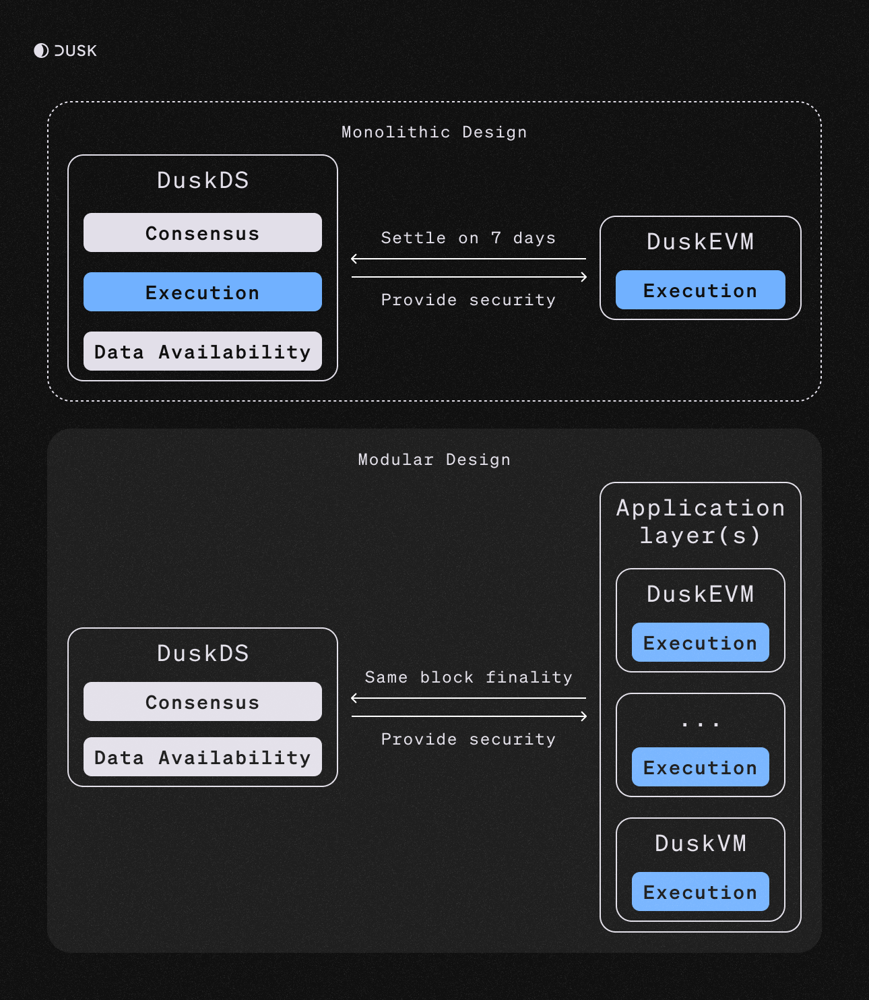

import { LinkCard, Card, CardGrid } from '@astrojs/starlight/components';

This documentation provides an insight into everything related to development on Dusk. It covers the creation of smart contracts, but also how to integrate Dusk and its applications into your own projects.

## Developing on Dusk

The Dusk architecture offers a data availability layer ([DuskDS](/developer/integrations/introduction)) and an execution layer ([DuskEVM](/developer/smart-contracts-dusk-evm/deploy-on-evm)). 
Depending on the use case, developers may want to integrate with one or another. 

For a smoother integration, it is generally recomended to integrate with [DuskEVM](/developer/smart-contracts-dusk-evm/deploy-on-evm).

It needs to be noted that Dusk is transitioning from a monolithic architecture towards a modular one. The difference between the two is represented in the picture below:

<CardGrid>
        <LinkCard title="Smart Contracts" href="/developer/smart-contract/introduction" description="Writing smart contracts for Dusk"/>
        <LinkCard title="Integrate with DuskEVM" href="/developer/smart-contracts-dusk-evm/deploy-on-evm" description="Deploy your smart contracts on DuskEVM"/>
        <LinkCard title="Integrate with DuskDS" href="/developer/integrations/introduction" description="Integrate your applications with DuskDS"/>
        <LinkCard title="Dusk Improvement Proposals" href="/developer/contribute/dips" description="Contribute to the core protocol development"/>
</CardGrid>
