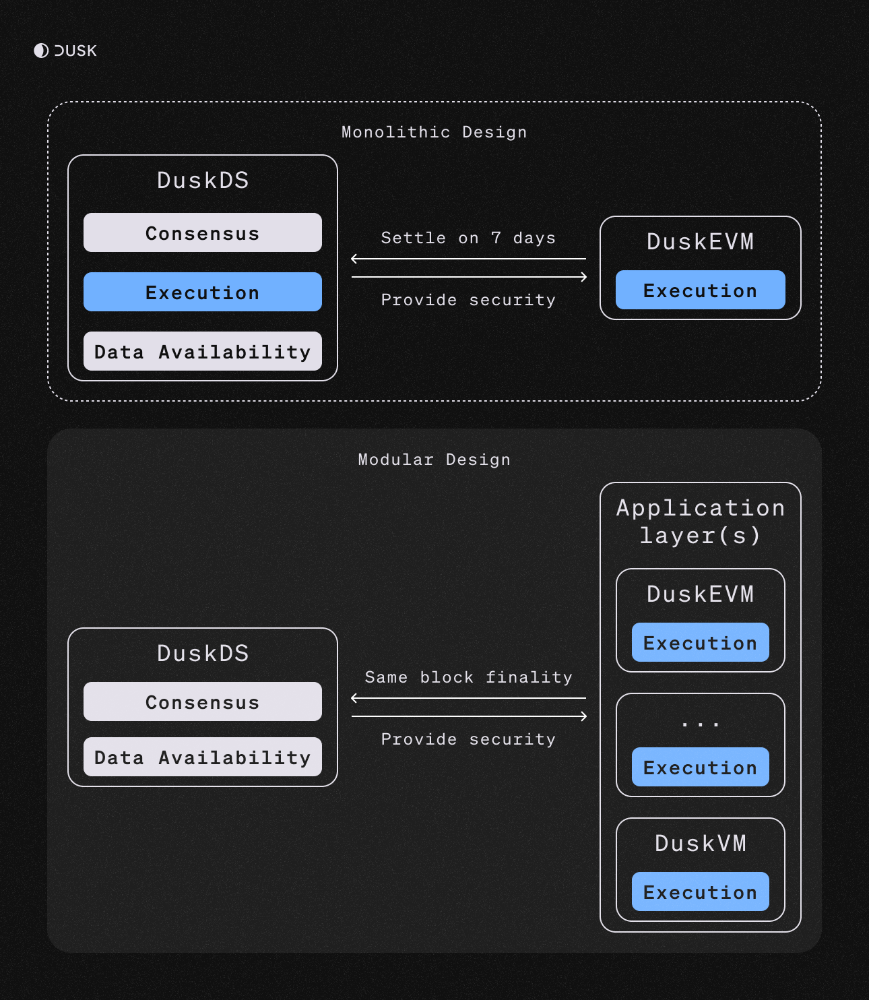

DuskEVM is an EVM-equivalent execution environment within the modular Dusk stack, delivering scalable smart contract execution while inheriting security, consensus, and settlement guarantees from DuskDS.

DuskEVM enables developers to deploy smart contracts using standard EVM tooling while benefiting from a modular architecture designed to support regulatory compliance and meet the needs of financial institutions.

:::note[Note]
The separation of execution environments like DuskEVM from DuskDS introduces modularity into Dusk’s architecture, enabling scalability, extensibility, and protocol composability.
:::

:::note[Note]
EVM-equivalence means that DuskEVM executes transactions using the exact same rules as Ethereum clients. This allows Ethereum smart contracts, tools, and infrastructure to run on DuskEVM without any changes or custom integrations.
:::

## Dusk's Modular Stack

With the introduction of DuskEVM, Dusk has expanded into a modular stack, providing a clean separation between settlement and execution environments:

| Layer            | Description                                                                 |
|------------------|-----------------------------------------------------------------------------|
| **DuskDS**        | Settlement and data availability layer.|
| **DuskEVM**       | EVM execution environment                     |
| **DuskVM**        | Execution environment using Phoenix                  |

DuskDS provides consensus, data availability, and settlement for the disintermediate trading of securities and other regulated assets.

Execution environments like DuskEVM operate at the application layer, where disintermediation logic is executed. These environments can incorporate advanced cryptographic techniques, such as ZK and FHE, to enable privacy-preserving and compliant computations.

:::note[Note]
Dusk's modular architecture makes Dusk highly extensible and composable, as new execution environments can be introduced without modifying the consensus and settlement layer.
:::

## How DuskEVM works

The Ethereum Virtual Machine (EVM) is a general-purpose, stack-based, stateless execution environment that processes smart contract logic. As the EVM is independent of consensus and data availability, it can be instantiated independently.

DuskEVM leverages the <a href="https://docs.optimism.io/stack/getting-started" target="_blank">OP Stack</a> and supports <a href="https://www.eip4844.com/" target="_blank">EIP-4844</a> (Proto-Danksharding)

While DuskEVM uses the OP Stack architecture, it settles directly using DuskDS rather than Ethereum. This required no modification to <a href="https://github.com/ethereum-optimism/optimism" target="_blank">Optimism</a> core components and it has been implemented by adding additional services.

DuskEVM leverages DuskDS to store blobs, enabling developers to use EVM tooling while relying on DuskDS for settlement and data availability.

:::note[Note]
DuskEVM currently inherits a 7-day challenge period from the OP Stack. This is a temporary limitation, as future upgrades will introduce one-block finality.
:::

## Architecture

The diagram below illustrates Dusk’s evolution from a monolithic design to a modular architecture, where DuskDS acts as the foundational consensus, settlement and data availability layer, and multiple execution environments operate independently at the application layer:

:::note[Note]
DuskEVM currently inherits a 7-day challenge period from the OP Stack. This is a temporary limitation, as future upgrades will introduce one-block finality.
:::

## Specifications

### Parameters
| Feature                   | Superchain        |
|---------------------------|-------------------|
| **Parent chain**          | DuskDS          |
| **Throughput**           | 32.5M gas/s       |
| **Gas limit**            | TBA              |
| **Blocktimes**           | TBA             |
| **Data availability support** | DuskDS    |
| **Gas token support**    | DUSK               |
| **EVM compatibility**     | Equivalent        |

### Opcodes

| Opcode      | Solidity Equivalent | Behavior                                                                                                                                         |
|-------------|---------------------|--------------------------------------------------------------------------------------------------------------------------------------------------|
| `COINBASE`  | `block.coinbase`    | Returns the address of the current Sequencer's fee wallet. Effectively the same as Ethereum, but typically does not change from block to block. |
| `PREVRANDAO`| `block.prevrandao`  | Returns the PREVRANDAO (the most recent RANDAO) value of DuskDS at the current DuskDS origin block.                                                      |
| `ORIGIN`    | `tx.origin`         | If the tx is a **DuskDS ⇒ DuskEVM** tx from a DuskDS smart contract, `tx.origin` is set to the **aliased address** of the originator. Else b

:::note[Note]
DuskEVM does not have a public mempool, as it is currently only visible to the Sequencer. The Sequencer executes transactions from the mempool in priority fee order (highest fee first).
:::

## Transactions Flow

The process for a rollup transaction has two requirements:
The transaction needs to be written to DuskDS, tipically by the <a href="https://github.com/ethereum-optimism/optimism/tree/v1.1.4/op-batcher" target="_blank">op-batcher</a>.

The transaction needs to be executed to modify the state (by <a href="https://github.com/ethereum-optimism/op-geth" target="_blank">op-geth</a>). Afterwards,  <a href="https://github.com/ethereum-optimism/optimism/tree/develop/op-proposer" target="_blank">op-proposer</a> writes a commitment to the post-transaction state to [DuskDS](/learn/core-components#duskds) . Note that op-proposer does not need to write a commitment after each transaction to DuskDS; it is OK to commit to the state after a block of transactions.

More information about the batching process can be seen in the  <a href="https://specs.optimism.io/protocol/derivation.html?utm_source=op-docs&utm_medium=docs#batch-submission" target="_blank">OP stack specs</a>.
