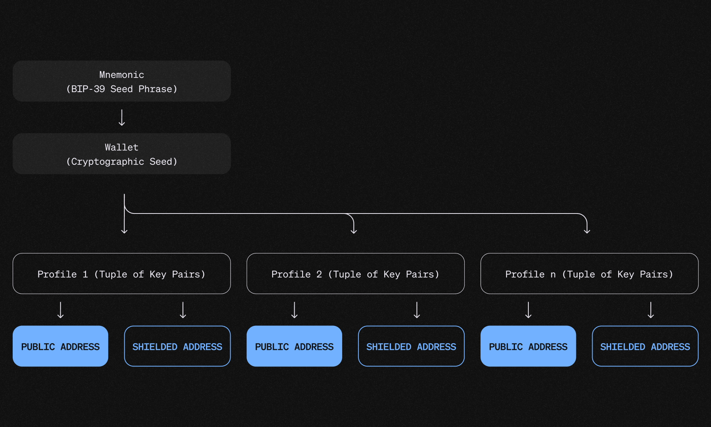

## Dusk terminology

#### Account

Accounts in Dusk manage transactions with different visibility levels. An account is linked to a profile and categorized as either a [Shielded Account](#shielded-account) (privacy-preserving) or a [Public Account](#public-account) (transparent).

#### Archive Node

An [archive node](/operator/archive-node) stores the full historical record of the Dusk blockchain and does not participate in consensus.

#### Citadel

[Citadel](/developer/digital-identity/protocol) is Dusk's identity and access layer (selective disclosure).

#### Confidential Security Contract Standard (XSC)

A standard for confidential smart contracts that can be adapted to business requirements (for example, privacy constraints and compliance rules).

#### DUSK

The native token of Dusk. It is used to pay for transaction fees (gas) and staking.

#### DuskDS

DuskDS is the settlement layer of the Dusk architecture: consensus, data availability, settlement, and the native transaction models.

#### DuskEVM

[DuskEVM](/learn/deep-dive/dusk-evm) is an EVM execution environment that uses DuskDS as its settlement and data availability layer.

#### DuskVM

[DuskVM](/learn/deep-dive/dusk-vm) is a WASM execution environment for Dusk-native smart contracts.

#### Hedger

Hedger is the evolution of Zedger, built on DuskEVM.

#### Stake Abstraction (Hyperstaking)

Stake abstraction (also called hyperstaking) lets smart contracts participate in staking and manage rewards with on-chain logic.

See: [Stake Abstraction](/learn/hyperstaking).

#### Kadcast

[Kadcast](/learn/core-components#network-layer-kadcast) is Dusk's P2P networking layer.

#### LUX

The smallest denomination of DUSK.

- `1 DUSK = 1,000,000,000 LUX`

#### Moonlight

[Moonlight](/learn/deep-dive/duskds-tx-models) is Dusk's public, account-based transaction model.

#### Phoenix

[Phoenix](/learn/deep-dive/duskds-tx-models) is Dusk's shielded, UTXO-based transaction model.

#### Profile

A profile is a pairing of a Moonlight (public) account and a Phoenix (shielded) account derived from a single mnemonic.

Wallets use profiles so you can manage both models side-by-side while keeping keys and addresses organized.

#### Provisioner

A provisioner is a staker running a node that can be selected for consensus duties (block generation and committee slots).

See: [Run a provisioner node](/operator/provisioner).

#### Public Account

A public account uses Moonlight and is designed for transparent transactions. It uses public addresses.

#### RUES

RUES (Rusk Universal Event System) is the event system used to stream chain events to external consumers.

#### Rusk

[Rusk](/learn/core-components#rusk) is the Rust node implementation of DuskDS.

#### Rusk Wallet

The [Rusk Wallet](/learn/rusk-wallet) is the official CLI wallet for Dusk.

#### Shielded Account

A shielded account uses Phoenix and is designed for privacy-preserving transactions.

#### Succinct Attestation

Succinct Attestation is Dusk's proof-of-stake consensus protocol.

#### W3sper SDK

[W3sper](/developer/integrations/w3sper) is a JavaScript library for integrating with the Dusk ecosystem.

#### Web Wallet

The [Web Wallet](/learn/web-wallet) is the official browser-based wallet for Dusk.

#### Zedger

[Zedger](/learn/core-components#zedger--hedger) is a protocol for private, compliant issuance and management of regulated assets.
