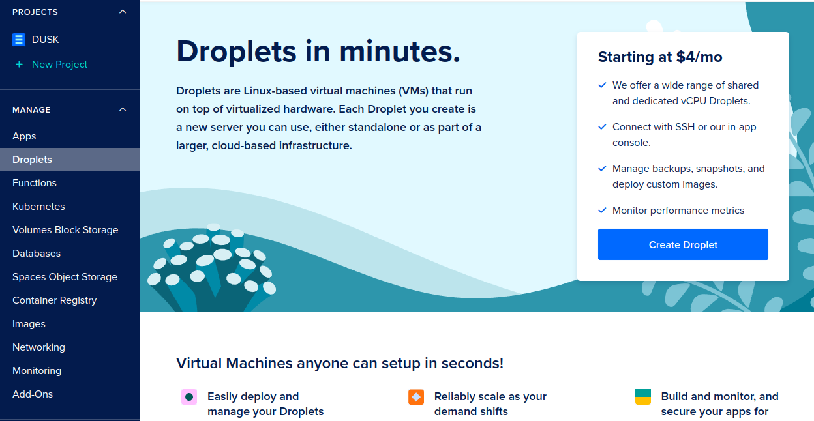
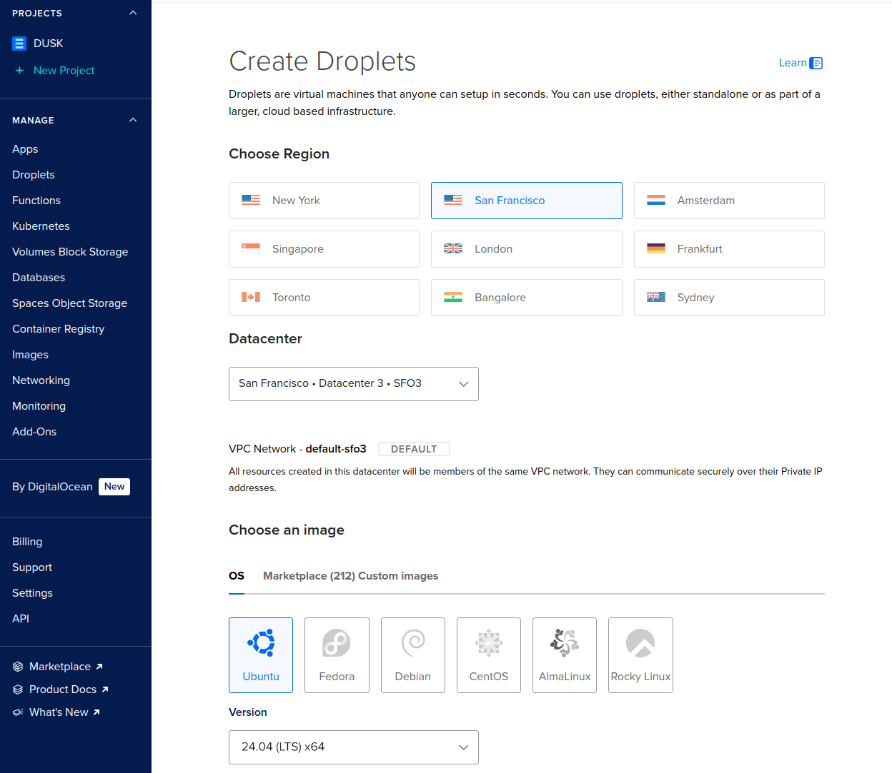
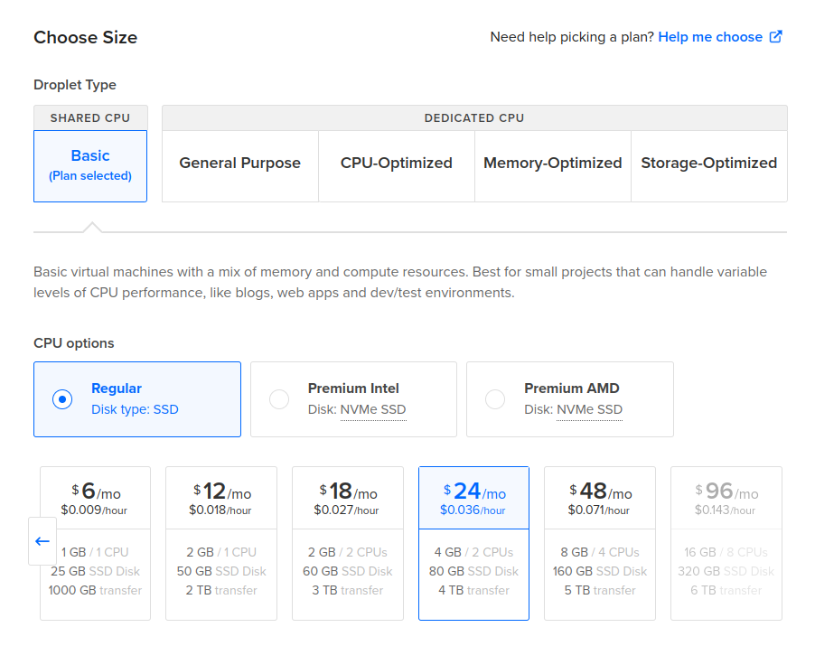
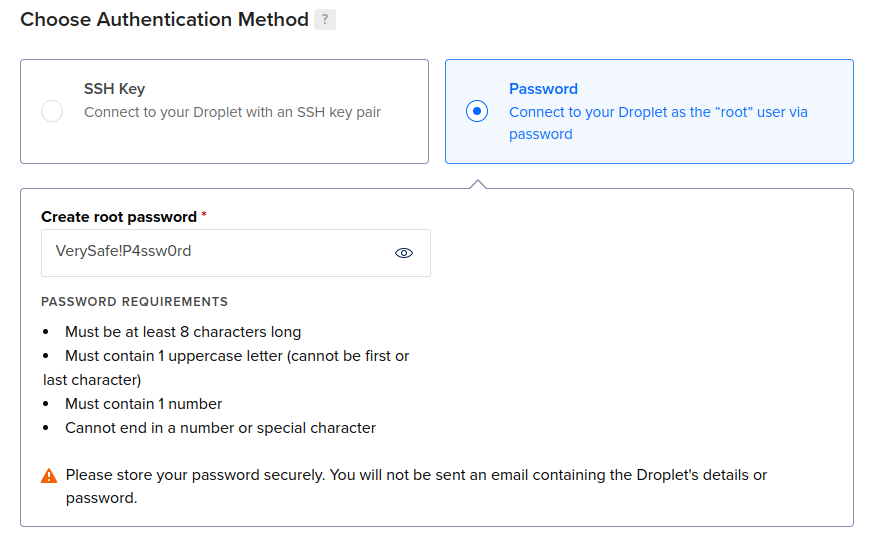
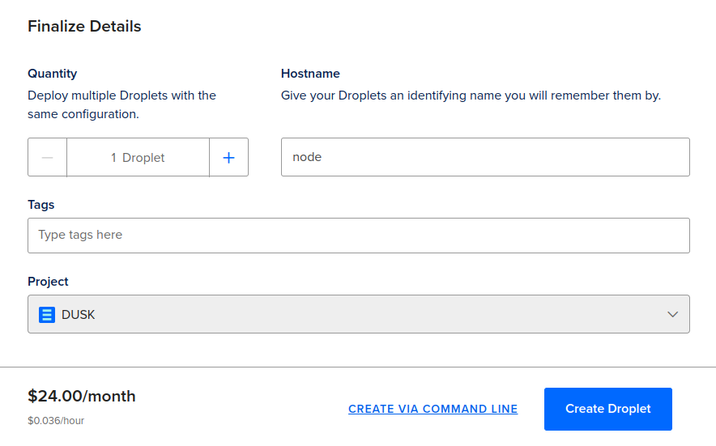
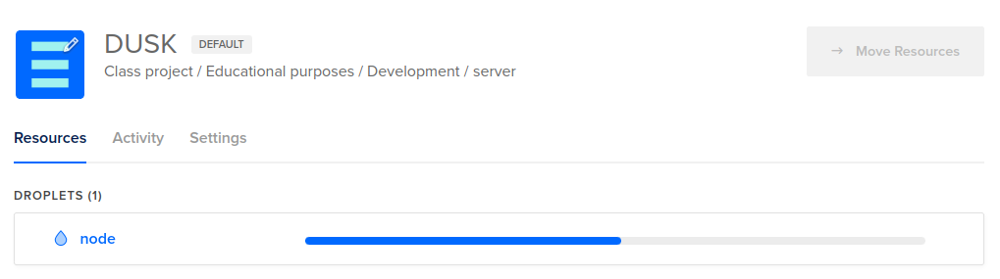
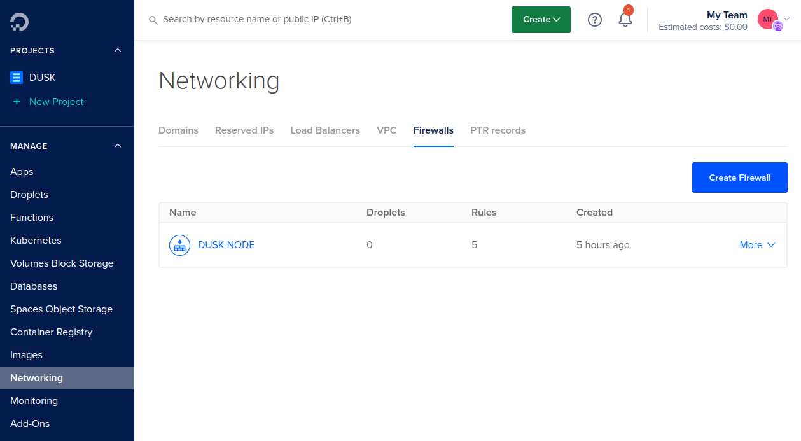
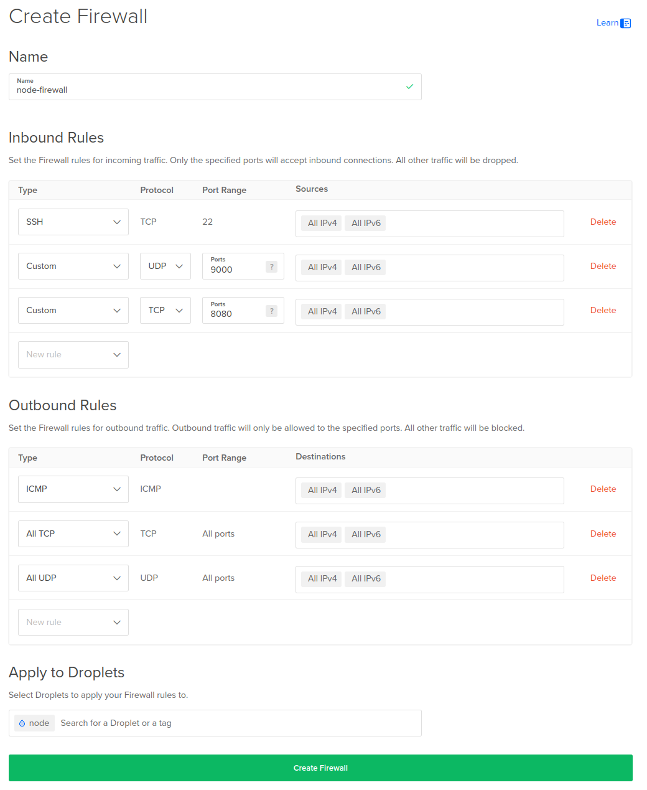

import { Tabs, TabItem } from '@astrojs/starlight/components';

Provisioners are full nodes that participate in consensus. To participate, you stake a **minimum of 1000 DUSK** and run a provisioner node 24/7.

If you only want to stake (without operating infrastructure), start with: [Staking basics](/learn/guides/staking-basics/).

## Provisioner Specifications

The following specifications support Provisioner nodes with limited proving capacity. It is always recommended to have at least 2 cores available.

| CPU            | RAM  | Storage | Network Connection |
| :------------- | :--- | :------ | :----------------- |
| 2 cores; 2 GHz | 4 GB | 50 GB   | 10 Mbps            |

## Run a Provisioner on Dusk

This is the shortest reliable path:

1. Create a server (Ubuntu 24.04).
2. Open ports: `22/tcp` (SSH), `9000/udp` (Kadcast). Optional: `8080/tcp` (HTTP server, mainly for archive/indexer use-cases).
3. Install the node with the official installer.
4. Set up the node wallet and stake.
5. Keep it upgraded and monitored.

## Create a droplet

You can run a provisioner on any VPS/provider as long as it matches the specs above and runs Ubuntu 24.04.

If you’re using DigitalOcean, see the optional walkthrough below.

<details>
  <summary>DigitalOcean walkthrough (optional)</summary>

DO uses droplets (Linux VMs). When you’re logged in, go to _Droplets_ and click _Create Droplet_.



1. Choose a region.
2. Choose image: **Ubuntu 24.04 (LTS) x64**.
3. Choose size: at least the [Provisioner Specifications](/operator/provisioner#provisioner-specifications).
4. Prefer SSH keys over passwords.






</details>

## Configure Firewall

Enable the required ports:

- `22/tcp` (SSH)
- `9000/udp` (Kadcast; consensus networking)
- Optional: `8080/tcp` (HTTP server; mainly for archive/indexer use-cases)

If you manage a local firewall, here’s a minimal `ufw` example:

```bash
sudo ufw limit ssh
sudo ufw allow 9000/udp
sudo ufw enable
```

<details>
  <summary>DigitalOcean firewall group (optional)</summary>

Create a firewall and open UDP `9000` (and optionally TCP `8080`).



</details>

## Install Rusk

SSH into your server (or use your provider’s web console).

### (Optional) Security baseline (recommended)

Run the node under a dedicated non-root user and use SSH keys (not passwords).

<details>
  <summary>Create a dedicated user (optional)</summary>

```sh
sudo groupadd --system dusk
sudo useradd -m -G dusk -s /bin/bash duskadmin
sudo passwd duskadmin
```

```sh
mkdir -p /home/duskadmin/.ssh
sudo nano /home/duskadmin/.ssh/authorized_keys
```
```sh
sudo chmod 700 /home/duskadmin/.ssh
sudo chmod 600 /home/duskadmin/.ssh/authorized_keys
sudo chown -R duskadmin:dusk /home/duskadmin/.ssh
```

```sh
sudo usermod -aG sudo duskadmin
```
</details>

### Install with the node installer

We've created an easy to use [node installer](https://github.com/dusk-network/node-installer). This installer will set up Rusk as a service on your droplet, preconfigure parts of the node, and provide a couple of helper scripts.

Install Rusk by pasting the following command on your server:

<Tabs syncKey="network">
   <TabItem label="Mainnet">
    ```sh
    curl --proto '=https' --tlsv1.2 -sSfL https://github.com/dusk-network/node-installer/releases/latest/download/node-installer.sh | sudo bash
    ```
   </TabItem>
   <TabItem label="Testnet">
    ```sh
    curl --proto '=https' --tlsv1.2 -sSfL https://github.com/dusk-network/node-installer/releases/latest/download/node-installer.sh | sudo bash -s -- --network testnet
    ```
   </TabItem>
   <TabItem label="Devnet">
    ```sh
    curl --proto '=https' --tlsv1.2 -sSfL https://github.com/dusk-network/node-installer/releases/latest/download/node-installer.sh | sudo bash -s -- --network devnet
    ```
   </TabItem>
</Tabs>

### Verify Installation

Once installed, verify the installer version with:

```sh
ruskquery version
```

You should see the latest version number confirming a successful installation.

## Configure Rusk

Now set up the node wallet and stake so you can participate in consensus.

Follow: [Node wallet setup](/operator/guides/node-wallet-setup/).

For next steps, see: [Maintenance & monitoring](/operator/maintenance-monitoring/) and [Upgrade your node](/operator/guides/upgrade-node/).
